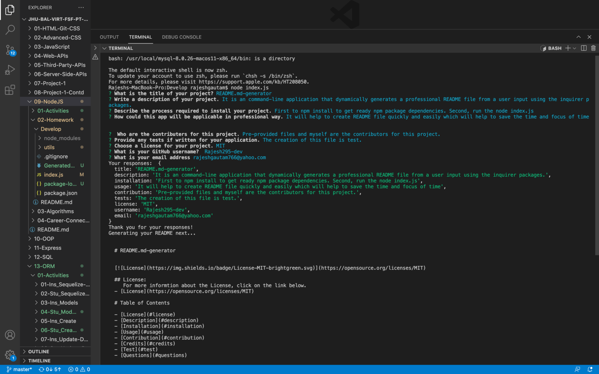
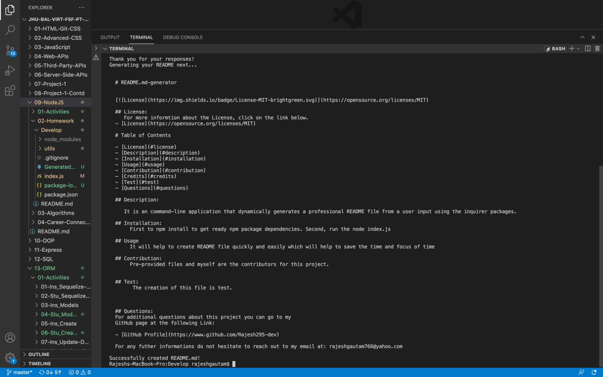

# README-Generator

## Description

 It is an command-line application which dynamically generates a professional README.md file from a users input using the inquirer package  [Node.js](https://nodejs.org/en/), and [Inquirer package](https://www.npmjs.com/package/inquirer) which helps the developer to invest and focused on his project.


## Feature

```bash
The application will be invoked by typing the command:
node index.js
```


## On this particular app user can generate README.md file with the following table of contents:

  - [Description](#description) 
  - [Installation](#installation)
  - [Usage](#usage)
  - [Contributing](#contributing)
  - [Credits](#credits)
  - [License](#license)
  - [Test](#test)
  - [Questions](#questions)


 


## Walkthrough video:

 [Click here for video](https://youtu.be/fSepl9tD1xY) 

## Screenshots:

 


  
## Link


* Link for the Github repository [Host by Github](https://github.com/Rajesh295-dev/note-Taker)
